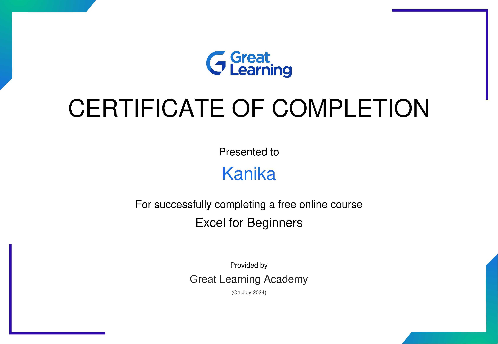

# MY INTRODUCTION 
Hello everyone ! 
I am ***Kanika***. I have done ***class 12th*** with **97.4 %** from ***Govt. Girls Senior Secondary Smart School , Phagwara*** . I am currently pursuing **B.TECH** in **Computer Science Engineering** at ***Guru Nanak Dev Engineering College , Ludhiana*** . I am very excited about my four year journey in this prestigious college and hope I will put my all 
efforts in my field . I am very interested in exploring and learning new things .

## CLASS 12th MARKS DETAIL :-

| SUBJECTS | MARKS OBTAINED | TOTAL MARKS |
| -------- | ----------- | -------------- |
| General English | 96 | 100 | 
| General Punjabi | 98 | 100 |
| Physics | 97 | 100 |
| Chemistry | 99 | 100 |
| Maths | 97 | 100 |
| **OVERALL MARKS** | **487** | **500** |

***Overall grade :- A+***
## Activities :-
Completed online excel course **E - Certificate** :-

# Student Induction Program 2024 

**DAY - 01**

**DATE - 10/07/24**

After taken admission in GNDEC , It was my first day as a part of this college . I was filled with lot of nervousness and excitement because i was going to meet up lot of new persons . We all gathered outside the Gurudwara Sahib and  college began with kirtan(paath) and after that we all together headed up to the auditorium where we all were welcomed with a warm and heartouching speeches giving by the guests of our college . They taught us a lot of valuable and energetic things so that we can feel comfortable on this place .

- **IAS,Harleen Parmar**

  (Chief guest of the day)
At the college auditorium, IAS Harleen Kaur was the first speaker of the day. She was alumni of the college. She was also student of BTech IT in 2002. She taught us that we can grab opportunities only if we are looking for them. She also shared about four major skills which every student should learn during their college time which include Subject Skills, Language Skills, People Skills & Life Skills.

- **Dr.Sehjpal Singh**
  (Current Principal)
Principal Dr. Sehijpal Singh shared his words of wisdom with us. He shared about process by which we can learn skills during the time at the college. He also said that engineering is a art of solving problems. He ensured us that we are in right hands and thus he movitated us to make the best use of this platform .  
   
- **Dr.S B Singh**
  (Ex - Principal)
Dr.S B Singh said that the GNE college provides a strong base that there is no any organisation or corner in the world where GNDEC student is not present. He also shared his valuable insights and experience. He shared about the strong alumni network of the college. He also stressed on the great Student-Teacher relation in the college.

- **S.Inderpal Singh**

  (NSET Director)
The NSET Director introduced us to the illustrious history of this institution , emphasizing its 100 years of shaping brilliant minds . He highlighted the first 36 years, which were dedicated to establishing the institttute . It was founded with the goal of addressing economic backwardness through technology. The foundation stone of the college laid in 1956. The vision of college is to admit 70% rural students to benefitthem with the advancement of technology.
-**Er. Jiwandeep Singh**

(PCS Officer and alumni of college)
Er.Jiwandeep Singh who is serving as a PCS Officer advice us to never wait for the opportunity to come to you , grap the opportunity . We should learn to grab the opportunity whenever we get chance. Never let it go .
- **S.Rajeshwar Singh**

(SSP and Chief guest of college)

SSP Rajeshwar Singh encouraged us to always walk on the path of good deeds and helping others. Our every good deed and bad deed always counted. He encouraged us to embrace four essential phrases:
- I am Sorry
- Please forgive me
- Thank you
- I love you

Afer every mistake and lie we should be sorry to the god immediately. We can lie to everyone but we cannot lie to ourselves and God. We ourselves knows the truth behind our lie. As Newton’s third law of motion states that every action has an equal and opposite reaction, similarly what we give to the world and nature, we always receive the same thing in return.
    
        

   

